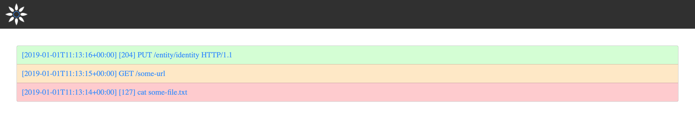
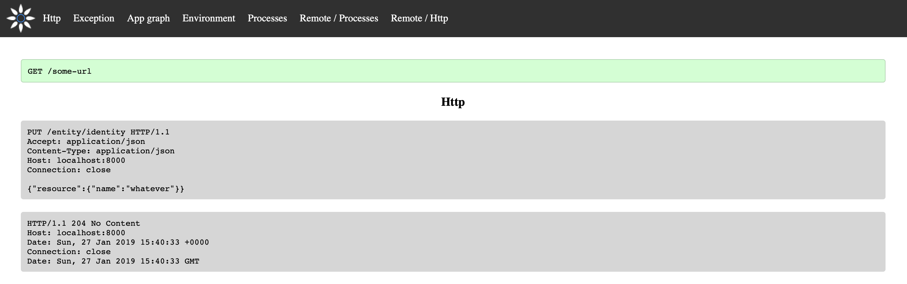
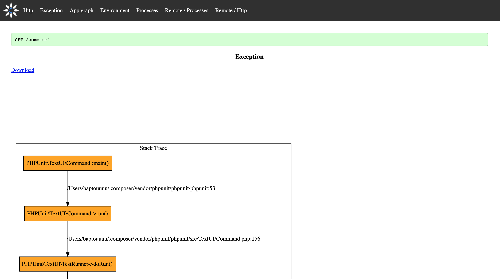
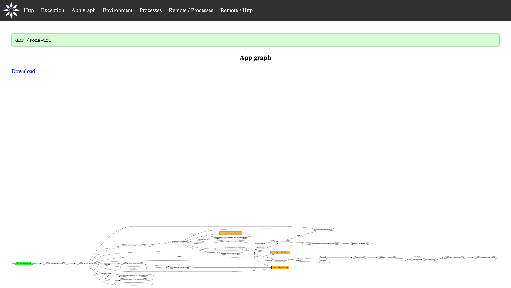
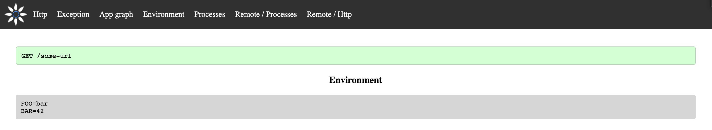
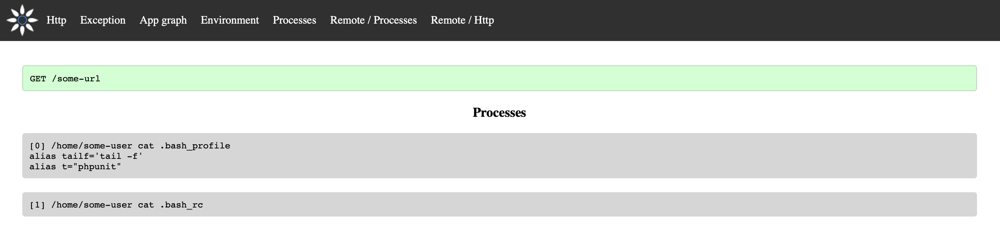
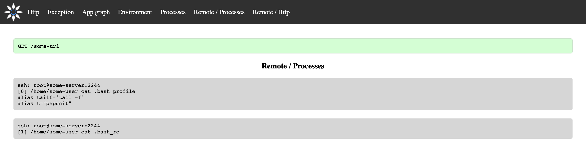

# Profiler

[](https://github.com/Innmind/Profiler/actions?query=workflow%3ACI)
[](https://codecov.io/gh/Innmind/Profiler)

App profiler to help profile any kind of applications (http or cli).

This package can be integrated in an existing app (using [`innmind/framework`](https://packagist.org/packages/innmind/framework)) or run as a [standalone app](docs/standalone.md)

## Installation

```sh
composer require innmind/profiler
```

## Overview

The profiler contains 2 types of entities: a profile and sections.

A profile contains a name (usually the http path called or the cli), the point in time the profile started, the status (succeeded, failed or pending) and an exit message.

A section is a part of a profile. By default there are 9 sections:
- Http: the request and response (if the app didn't crash) the app received
- Exception: the stack trace represented as graph (see [`innmind/stack-trace`](https://packagist.org/packages/innmind/stack-trace))
- App graph: the object graph representing the application (see [`innmind/object-graph`](https://packagist.org/packages/innmind/object-graph))
- Call graph: a flamechart
- Environment: the list of environment variables
- Processes: the list of commands run on the machine
- Remote / Http: all the http requests issued by the application
- Remote / Processes: all the commands run on a distant machine
- Remote / Sql: all the SQL queries issued to a database










## Documentation

All the documentation can be found in the [`docs`](docs/) folder.
