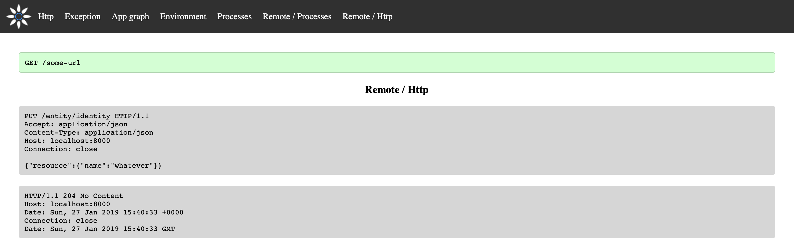

# Profiler

[](https://github.com/Innmind/Profiler/actions?query=workflow%3ACI)
[](https://codecov.io/gh/Innmind/Profiler)

(Framework agnostic) App profiler to help profile any kind of applications (http or cli).

## Why

For my side projects I decided to no longer use the Symfony framework to explore different ways to build apps. However Symfony ship with a builtin profiler to help debug the application, thus I lost this tool in my side projects.

The problem with the current state of frameworks is that they either provide a profiler coupled to the framework or do not provide any. Since I needed to build a profiler for my needs I decided to also address the problem that many applications can't have access to a profiler by building one decoupled from any framework.

The decoupling is guaranteed by 2 things:

- it's a standalone project (so the application is not altered by much)
- profiles are created via http, so we deal with raw values

## Installation

```sh
composer create-project innmind/profiler
```

## Overview

The profiler contains 2 types of entities: a profile and sections.

A profile contains a name (usually the http path called or the cli), the point in time the profile started, the status (succeeded, failed or pending) and an exit message.

A section is a part of a profile. By default there are 7 sections:
- Http: the request and response (if the app didn't crash) the app received
- Exception: the stack trace represented as graph (see [`innmind/stack-trace`](https://packagist.org/packages/innmind/stack-trace))
- App graph: the object graph representing the application (see [`innmind/object-graph`](https://packagist.org/packages/innmind/object-graph))
- Environment: the list of environment variables
- Processes: the list of commands run on the machine
- Remote / Http: all the http requests issued by the application
- Remote / Processes: all the commands run on a distant machine




## Usage

```sh
cd profiler-directory/public && php -S localhost:8000
```

This will start the php builtin webserver to expose the profiler on the local machine on the port `8000`. (You can change the port or use a real webserver such a nginx, the use of php webserver is for simplicity)

Then open `http://localhost:8000` in your browser to access the profiler.

To create new profiles you need to create them via http, you can use the [`innmind/rest-client`](https://packagist.org/packages/innmind/rest-client) to simplify the task. All the capabilities can be accessed via the url `OPTIONS http://localhost:8000/*`
